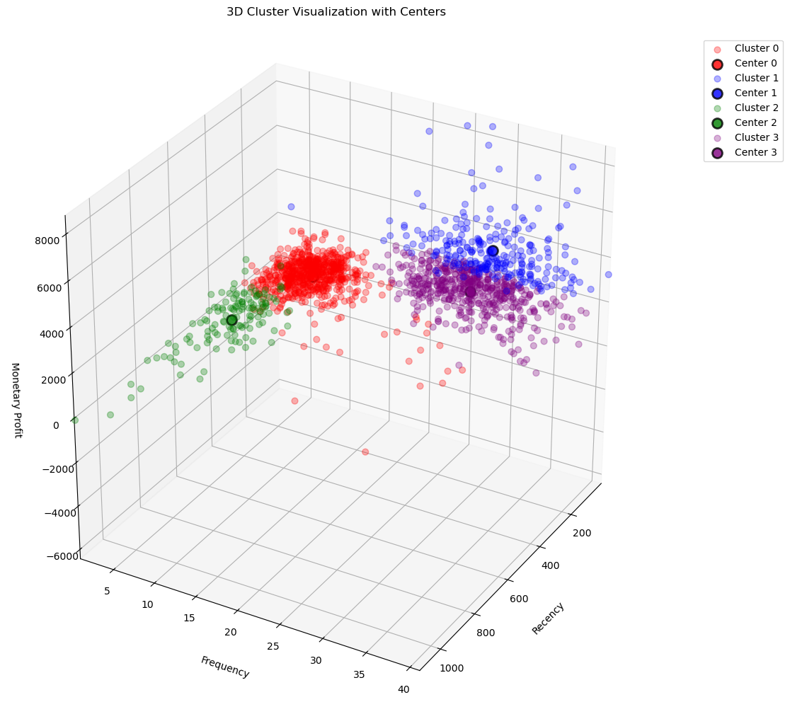

# Customer Segmentation Using RFM and KMeans

This project applies **RFM analysis** and **KMeans clustering** to identify customer segments in a retail dataset. It's suitable for marketing analytics, customer retention, and profitability analysis.

## Features

- RFM feature engineering
- Data scaling with `StandardScaler`
- Elbow method to find optimal k
- KMeans clustering
- 2D and 3D visualizations
- Cluster profiling

## How to Run

1. Clone the repo
2. Put your data in `data/raw/store.csv`
3. Run the notebook: `notebooks/rfm_analysis.ipynb`

## Example Outputs

## Tech Stack

- Python
- pandas 
- NumPy
- scikit-learn
- matplotlib

## Author

Alireza Salari 
alirezasa8110@gmail.com

## License

MIT
